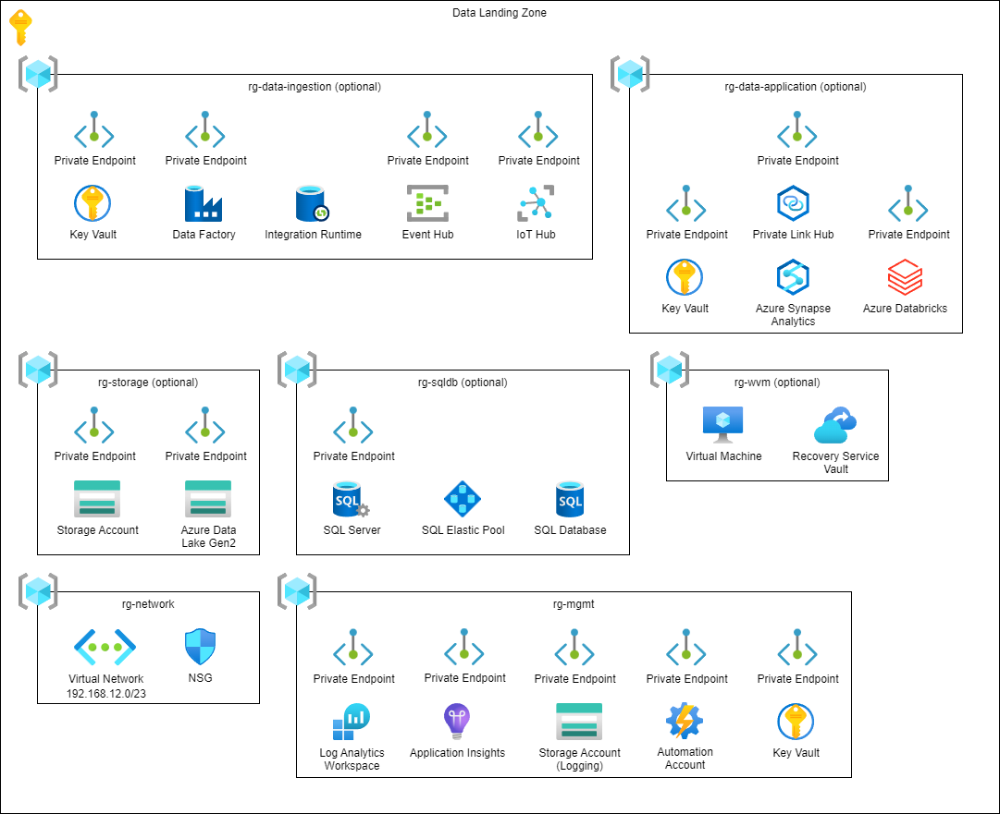

# Terraform - Azure - Data landing zone

## Table of Contents

* [Introduction](#introduction)
* [Pre-Requirements](#pre-requirements)
* [Modules](#modules)
  * [Shared](#shared)
  * [Storage](#storage)
  * [SQL Database](#sql-database)
  * [Data Ingestion](#data-ingestion)
  * [Data Application](#data-application)
  * [Windows Virtual Machine](#windows-virtual-machine)

## Introduction

This is a collection of Terraform scripts that can be used to create Azure resources for the data landing zone (Spoke).

## Azure Infrastructure



## Pre-Requirements

* Service Principal
* Remote Backend
* [terraform-azure-setup-remote-backed](https://github.com/gutt02/terraform-azure-setup-remote-backend)

## Modules

### Shared

#### Azure Resources

* Resource Group
* Virtual Network and Subnets
* Network Security Groups
* Log Analytics Workspace
* Application Insights
* Storage Account (Logging)
* Automation Account
* Key Vault
* Private Endpoints

#### Variables

```hcl
# curl ipinfo.io/ip
variable "agent_ip" {
  type        = string
  description = "IP of the deployment agent."
}
```

```hcl
# curl ipinfo.io/ip
variable "client_ip" {
  type = object({
    name             = string
    cidr             = string
    start_ip_address = string
    end_ip_address   = string
  })

  description = "Client IP."
}
```

```hcl
variable "client_secret" {
  type        = string
  sensitive   = true
  description = "Client secret of the service principal."
}
```

```hcl
variable "clz_network_resource_group_name" {
  type        = string
  default     = null
  description = "Name of the network resource group in the data landing zone (Hub)"
}
```

```hcl
variable "clz_subnet_gateway_id" {
  type        = string
  default     = null
  description = "Id of the Gateway in the data landing zone (Hub)."
}
```

```hcl
variable "clz_virtual_network_id" {
  type        = string
  default     = null
  description = "Id of the data landing zone (Hub) VNET, null means no peering."
}
```

```hcl
variable "clz_virtual_network_name" {
  type        = string
  default     = null
  description = "Name of the data landing zone (Hub) VNET, null means no peering."
}
```

```hcl
variable "dns_zone_azure_automation_id" {
  type        = string
  description = "Id of the private DNS zone for the Automation Account."
}
```

```hcl
variable "dns_zone_agentsvc_azure_automation_id" {
  type        = string
  description = "Id of the private DNS zone for the Agent Service Azure Automation."
}
```

```hcl
variable "dns_zone_blob_id" {
  type        = string
  description = "Id of the private DNS zone for the Storage Blob."
}
```

```hcl
variable "dns_zone_monitor_id" {
  type        = string
  description = "Id of the private DNS zone for the Azure Monitor."
}
```

```hcl
variable "dns_zone_ods_opinsights_id" {
  type        = string
  description = "Id of the private DNS zone for the ODS Opinsights."
}
```

```hcl
variable "dns_zone_oms_opinsights_id" {
  type        = string
  description = "Id of the private DNS zone for the OMS Opinsights."
}
```

```hcl
variable "dns_zone_vaultcore_id" {
  type        = string
  description = "Id of the private DNS zone for the Key Vault."
}
```

```hcl
variable "location" {
  type        = string
  default     = "westeurope"
  description = "Default Azure region, use Azure CLI notation."
}
```

```hcl
variable "on_premises_networks" {
  type = list(object({
    name             = string
    cidr             = string
    start_ip_address = string
    end_ip_address   = string
  }))

  default = [
    {
      name             = "AllowFromOnPremises1"
      cidr             = "10.0.0.0/24"
      start_ip_address = "10.0.0.0"
      end_ip_address   = "10.0.0.255"
    }
  ]

  description = "List of on-premises networks."
}
```

```hcl
variable "project" {
  type = object({
    customer    = string
    name        = string
    environment = string
  })

  default = {
    customer    = "azc"
    name        = "dlz"
    environment = "vse"
  }

  description = "Project details, like customer name, environment, etc."
}
```

```hcl
# https://docs.microsoft.com/en-us/azure/role-based-access-control/built-in-roles
# https://docs.microsoft.com/en-us/azure/key-vault/general/rbac-guide
# https://docs.microsoft.com/en-us/azure/synapse-analytics/security/synapse-workspace-synapse-rbac-roles
variable "security_groups" {
  type = list(object({
    name       = string
    object_ids = list(string)

    role_assignments = object({
      data_factory      = list(string)
      key_vault         = list(string)
      log_analytics     = list(string)
      mssql_server      = list(string)
      resource_group    = list(string)
      storage_account   = list(string)
      synapse_workspace = list(string)
    })
  }))

  default = [
    {
      # Data and Platform Engineer
      name       = "data_platform_engineer"
      object_ids = ["161b5111-f7f8-491e-b719-7d452500d1f1"]
      role_assignments = {
        "data_factory"   = ["Data Factory Contributor"]
        "key_vault"      = ["Key Vault Administrator"]
        "log_analytics"  = ["Log Analytics Contributor"]
        "mssql_server"   = []
        "resource_group" = ["Contributor"]
        "storage_account" = [
          "Storage Account Contributor",
          "Storage Blob Data Contributor",
          "Storage File Data SMB Share Contributor",
          "Storage Queue Data Contributor",
          "Storage Table Data Contributor"
        ]
        "synapse_workspace" = ["Apache Spark Administrator", "Synapse Administrator", "Synapse Contributor", "Synapse SQL Administrator"]
      }
    },
    {
      # Data Analyst
      name       = "data_analyst"
      object_ids = ["8381e24c-e540-4349-b801-4938c857ffdf"]
      role_assignments = {
        "data_factory"   = []
        "key_vault"      = ["Key Vault Reader"]
        "log_analytics"  = ["Log Analytics Reader"]
        "mssql_server"   = []
        "resource_group" = ["Reader"]
        "storage_account" = [
          "Storage Blob Data Reader",
          "Storage File Data SMB Share Reader",
          "Storage Queue Data Reader",
          "Storage Table Data Reader"
        ]
        "synapse_workspace" = ["Synapse Artifact Publisher", "Synapse Artifact User"]
      }
    },
    {
      # Data Scientist
      name       = "data_scientist"
      object_ids = ["33a274c1-556d-43fd-b133-5262f97212f2"]
      role_assignments = {
        "data_factory"   = []
        "key_vault"      = ["Key Vault Reader"]
        "log_analytics"  = ["Log Analytics Reader"]
        "mssql_server"   = []
        "resource_group" = ["Reader"]
        "storage_account" = [
          "Storage Blob Data Reader",
          "Storage File Data SMB Share Reader",
          "Storage Queue Data Reader",
          "Storage Table Data Reader"
        ]
        "synapse_workspace" = ["Synapse Artifact Publisher", "Synapse Artifact User"]
      }
    },
    {
      # Data Steward
      name       = "data_steward"
      object_ids = ["ed09ccea-947c-4beb-b37e-1f2d2e11a554"]
      role_assignments = {
        "data_factory" = ["Data Factory Contributor"]
        "key_vault" = [
          "Key Vault Certificates Officer",
          "Key Vault Crypto Officer",
          "Key Vault Secrets Officer"
        ]
        "log_analytics"     = ["Log Analytics Reader"]
        "mssql_server"      = []
        "resource_group"    = ["Reader"]
        "storage_account"   = ["Storage Blob Data Owner"]
        "synapse_workspace" = ["Synapse Artifact Publisher", "Synapse Artifact User"]
      }
    },
  ]

  description = "RBAC and key vault access policy for Azure Active Directory security groups and users."
}
```

```hcl
variable "tags" {
  type = object({
    created_by  = string
    contact     = string
    customer    = string
    environment = string
    project     = string
  })

  default = {
    created_by  = "azc-iac-payg-sp-tf"
    contact     = "contact@me"
    customer    = "Azure Cloud"
    environment = "Visual Studio Enterprise"
    project     = "Data Landing Zone"
  }

  description = "Default tags for resources, only applied to resource groups."
}
```

```hcl
variable "virtual_network" {
  type = object({
    address_space = string

    subnets = map(object({
      name          = string
      address_space = string
    }))
  })

  default = {
    address_space = "192.168.12.0/23"
    subnets = {
      shared_services = {
        name          = "shared-services"
        address_space = "192.168.12.0/28"
      },
      virtual_machines = {
        name          = "virtual-machines"
        address_space = "192.168.12.16/28"
      },
      private_endpoints = {
        name          = "private-endpoints"
        address_space = "192.168.12.64/26"
      }
      databricks_private = {
        name          = "databricks-private"
        address_space = "192.168.12.128/26"
      }
      databricks_public = {
        name          = "databricks-public"
        address_space = "192.168.12.192/26"
      }
    }
  }

  description = "VNET details."
}
```

### Storage

#### Azure Resources

* Resource Group
* Storage Account
* Azure Data Lake Gen2
* Private Endpoints

#### Variables

```hcl
# curl ipinfo.io/ip
variable "agent_ip" {
  type        = string
  description = "IP of the deployment agent."
}
```

```hcl
# curl ipinfo.io/ip
variable "client_ip" {
  type = object({
    name             = string
    cidr             = string
    start_ip_address = string
    end_ip_address   = string
  })

  description = "Client IP."
}
```

```hcl
variable "client_secret" {
  type        = string
  sensitive   = true
  description = "Client secret of the service principal."
}
```

```hcl
variable "clz_subnet_gateway_id" {
  type        = string
  default     = null
  description = "Id of the Gateway in the data landing zone (Hub)."
}
```

```hcl
variable "dns_zone_blob_id" {
  type        = string
  description = "Id of the private DNS zone for the Storage Blob."
}
```

```hcl
variable "dns_zone_dfs_id" {
  type        = string
  description = "Id of the private DNS zone for the Storage Data Lake Gen2."
}
```

```hcl
variable "dns_zone_file_id" {
  type        = string
  description = "Id of the private DNS zone for the Storage File."
}
```

```hcl
variable "dns_zone_queue_id" {
  type        = string
  description = "Id of the private DNS zone for the Storage Queue."
}
```

```hcl
variable "dns_zone_table_id" {
  type        = string
  description = "Id of the private DNS zone for the Storage Table."
}
```

```hcl
variable "location" {
  type        = string
  default     = "westeurope"
  description = "Default Azure region, use Azure CLI notation."
}
```

```hcl
variable "on_premises_networks" {
  type = list(object({
    name             = string
    cidr             = string
    start_ip_address = string
    end_ip_address   = string
  }))

  default = [
    {
      name             = "AllowFromOnPremises1"
      cidr             = "10.0.0.0/24"
      start_ip_address = "10.0.0.0"
      end_ip_address   = "10.0.0.255"
    }
  ]

  description = "List of on-premises networks."
}
```

```hcl
variable "project" {
  type = object({
    customer    = string
    name        = string
    environment = string
  })

  default = {
    customer    = "azc"
    name        = "dlz"
    environment = "vse"
  }

  description = "Project details, like customer name, environment, etc."
}
```

```hcl
# https://docs.microsoft.com/en-us/azure/role-based-access-control/built-in-roles
# https://docs.microsoft.com/en-us/azure/key-vault/general/rbac-guide
# https://docs.microsoft.com/en-us/azure/synapse-analytics/security/synapse-workspace-synapse-rbac-roles
variable "security_groups" {
  type = list(object({
    name       = string
    object_ids = list(string)

    role_assignments = object({
      data_factory      = list(string)
      key_vault         = list(string)
      log_analytics     = list(string)
      mssql_server      = list(string)
      resource_group    = list(string)
      storage_account   = list(string)
      synapse_workspace = list(string)
    })
  }))

  default = [
    {
      # Data and Platform Engineer
      name       = "data_platform_engineer"
      object_ids = ["161b5111-f7f8-491e-b719-7d452500d1f1"]
      role_assignments = {
        "data_factory"   = ["Data Factory Contributor"]
        "key_vault"      = ["Key Vault Administrator"]
        "log_analytics"  = ["Log Analytics Contributor"]
        "mssql_server"   = []
        "resource_group" = ["Contributor"]
        "storage_account" = [
          "Storage Account Contributor",
          "Storage Blob Data Contributor",
          "Storage File Data SMB Share Contributor",
          "Storage Queue Data Contributor",
          "Storage Table Data Contributor"
        ]
        "synapse_workspace" = ["Apache Spark Administrator", "Synapse Administrator", "Synapse Contributor", "Synapse SQL Administrator"]
      }
    },
    {
      # Data Analyst
      name       = "data_analyst"
      object_ids = ["8381e24c-e540-4349-b801-4938c857ffdf"]
      role_assignments = {
        "data_factory"   = []
        "key_vault"      = ["Key Vault Reader"]
        "log_analytics"  = ["Log Analytics Reader"]
        "mssql_server"   = []
        "resource_group" = ["Reader"]
        "storage_account" = [
          "Storage Blob Data Reader",
          "Storage File Data SMB Share Reader",
          "Storage Queue Data Reader",
          "Storage Table Data Reader"
        ]
        "synapse_workspace" = ["Synapse Artifact Publisher", "Synapse Artifact User"]
      }
    },
    {
      # Data Scientist
      name       = "data_scientist"
      object_ids = ["33a274c1-556d-43fd-b133-5262f97212f2"]
      role_assignments = {
        "data_factory"   = []
        "key_vault"      = ["Key Vault Reader"]
        "log_analytics"  = ["Log Analytics Reader"]
        "mssql_server"   = []
        "resource_group" = ["Reader"]
        "storage_account" = [
          "Storage Blob Data Reader",
          "Storage File Data SMB Share Reader",
          "Storage Queue Data Reader",
          "Storage Table Data Reader"
        ]
        "synapse_workspace" = ["Synapse Artifact Publisher", "Synapse Artifact User"]
      }
    },
    {
      # Data Steward
      name       = "data_steward"
      object_ids = ["ed09ccea-947c-4beb-b37e-1f2d2e11a554"]
      role_assignments = {
        "data_factory" = ["Data Factory Contributor"]
        "key_vault" = [
          "Key Vault Certificates Officer",
          "Key Vault Crypto Officer",
          "Key Vault Secrets Officer"
        ]
        "log_analytics"     = ["Log Analytics Reader"]
        "mssql_server"      = []
        "resource_group"    = ["Reader"]
        "storage_account"   = ["Storage Blob Data Owner"]
        "synapse_workspace" = ["Synapse Artifact Publisher", "Synapse Artifact User"]
      }
    },
  ]

  description = "RBAC and key vault access policy for Azure Active Directory security groups and users."
}
```

```hcl
variable "storage_account" {
  type = list(object({
    account_kind             = optional(string)
    account_replication_type = string
    account_tier             = string
    is_hns_enabled           = optional(bool, false)
    linked_service           = optional(string, "disabled")
    suffix                   = string

    private_endpoints = list(string)
  }))

  default = [
    {
      account_tier             = "Standard"
      account_replication_type = "LRS"
      linked_service           = "enabled"
      suffix                   = "blob"

      private_endpoints = [
        "blob",
        "table"
      ]
    },
    {
      account_tier             = "Standard"
      account_replication_type = "LRS"
      is_hns_enabled           = true
      linked_service           = "enabled"
      suffix                   = "adls"

      private_endpoints = [
        "blob",
        "dfs"
      ]
    }
  ]

  description = "Configuration of Azure Storage Account"
}
```

```hcl
variable "subnet_private_endpoints_id" {
  type        = string
  description = "Id of the subnet for the private endpoints."
}
```

```hcl
variable "tags" {
  type = object({
    created_by  = string
    contact     = string
    customer    = string
    environment = string
    project     = string
  })

  default = {
    created_by  = "azc-iac-payg-sp-tf"
    contact     = "contact@me"
    customer    = "Azure Cloud"
    environment = "Visual Studio Enterprise"
    project     = "Data Landing Zone"
  }

  description = "Default tags for resources, only applied to resource groups."
}
```

### SQL Database

#### Azure Resources

* Resource Group
* SQL Server
* SQL Elastic Pool
* SQL Database
* Private Endpoints

#### Variables

```hcl
# curl ipinfo.io/ip
variable "agent_ip" {
  type        = string
  description = "IP of the deployment agent."
}
```

```hcl
# curl ipinfo.io/ip
variable "client_ip" {
  type = object({
    name             = string
    cidr             = string
    start_ip_address = string
    end_ip_address   = string
  })

  description = "Client IP."
}
```

```hcl
variable "clz_subnet_gateway_id" {
  type        = string
  default     = null
  description = "Id of the Gateway in the data landing zone (Hub)."
}
```

```hcl
variable "client_secret" {
  type        = string
  sensitive   = true
  description = "Client secret of the service principal."
}
```

```hcl
variable "dns_zone_database_id" {
  type        = string
  description = "Id of the private DNS zone for the SQL database."
}
```

```hcl
variable "location" {
  type        = string
  default     = "westeurope"
  description = "Default Azure region, use Azure CLI notation."
}
```

```hcl
variable "log_primary_blob_endpoint" {
  type        = string
  description = "Primary Blob endpoint of the Log Storage Account."
}
```

```hcl
variable "log_storage_account_id" {
  type        = string
  description = "Id of the Log Storage Account."
}
```

```hcl
variable "mssql_server" {
  type = object({
    azuread_authentication_only   = bool
    public_network_access_enabled = bool
    version                       = string

    elastic_pool = optional(object({
      license_type                       = string
      max_size_gb                        = number
      sku_name                           = string
      sku_tier                           = string
      sku_family                         = string
      sku_capacity                       = number
      per_database_settings_min_capacity = number
      per_database_settings_max_capacity = number
    }))

    databases = optional(list(object({
      name           = string
      collation      = string
      linked_service = optional(string, "disabled")
      sku_name       = string
    })))
  })

  default = {
    azuread_authentication_only   = true
    public_network_access_enabled = true
    version                       = "12.0"

    elastic_pool = {
      license_type                       = "LicenseIncluded"
      max_size_gb                        = 9.7656250
      sku_name                           = "BasicPool"
      sku_tier                           = "Basic"
      sku_family                         = null
      sku_capacity                       = 100
      per_database_settings_min_capacity = 0
      per_database_settings_max_capacity = 5
    }

    databases = [
      {
        name           = "DBSDLZVSE01"
        collation      = "SQL_Latin1_General_CP1_CI_AS"
        linked_service = "enabled"
        sku_name       = "Basic"
      }
    ]
  }

  description = "Configuration of Azure SQL Server and databases."
}
```

```hcl
variable "on_premises_networks" {
  type = list(object({
    name             = string
    cidr             = string
    start_ip_address = string
    end_ip_address   = string
  }))

  default = [
    {
      name             = "AllowFromOnPremises1"
      cidr             = "10.0.0.0/24"
      start_ip_address = "10.0.0.0"
      end_ip_address   = "10.0.0.255"
    }
  ]

  description = "List of on-premises networks."
}
```

```hcl
variable "project" {
  type = object({
    customer    = string
    name        = string
    environment = string
  })

  default = {
    customer    = "azc"
    name        = "dlz"
    environment = "vse"
  }

  description = "Project details, like customer name, environment, etc."
}
```

```hcl
# https://docs.microsoft.com/en-us/azure/role-based-access-control/built-in-roles
# https://docs.microsoft.com/en-us/azure/key-vault/general/rbac-guide
# https://docs.microsoft.com/en-us/azure/synapse-analytics/security/synapse-workspace-synapse-rbac-roles
variable "security_groups" {
  type = list(object({
    name       = string
    object_ids = list(string)

    role_assignments = object({
      data_factory      = list(string)
      key_vault         = list(string)
      log_analytics     = list(string)
      mssql_server      = list(string)
      resource_group    = list(string)
      storage_account   = list(string)
      synapse_workspace = list(string)
    })
  }))

  default = [
    {
      # Data and Platform Engineer
      name       = "data_platform_engineer"
      object_ids = ["161b5111-f7f8-491e-b719-7d452500d1f1"]
      role_assignments = {
        "data_factory"   = ["Data Factory Contributor"]
        "key_vault"      = ["Key Vault Administrator"]
        "log_analytics"  = ["Log Analytics Contributor"]
        "mssql_server"   = []
        "resource_group" = ["Contributor"]
        "storage_account" = [
          "Storage Account Contributor",
          "Storage Blob Data Contributor",
          "Storage File Data SMB Share Contributor",
          "Storage Queue Data Contributor",
          "Storage Table Data Contributor"
        ]
        "synapse_workspace" = ["Apache Spark Administrator", "Synapse Administrator", "Synapse Contributor", "Synapse SQL Administrator"]
      }
    },
    {
      # Data Analyst
      name       = "data_analyst"
      object_ids = ["8381e24c-e540-4349-b801-4938c857ffdf"]
      role_assignments = {
        "data_factory"   = []
        "key_vault"      = ["Key Vault Reader"]
        "log_analytics"  = ["Log Analytics Reader"]
        "mssql_server"   = []
        "resource_group" = ["Reader"]
        "storage_account" = [
          "Storage Blob Data Reader",
          "Storage File Data SMB Share Reader",
          "Storage Queue Data Reader",
          "Storage Table Data Reader"
        ]
        "synapse_workspace" = ["Synapse Artifact Publisher", "Synapse Artifact User"]
      }
    },
    {
      # Data Scientist
      name       = "data_scientist"
      object_ids = ["33a274c1-556d-43fd-b133-5262f97212f2"]
      role_assignments = {
        "data_factory"   = []
        "key_vault"      = ["Key Vault Reader"]
        "log_analytics"  = ["Log Analytics Reader"]
        "mssql_server"   = []
        "resource_group" = ["Reader"]
        "storage_account" = [
          "Storage Blob Data Reader",
          "Storage File Data SMB Share Reader",
          "Storage Queue Data Reader",
          "Storage Table Data Reader"
        ]
        "synapse_workspace" = ["Synapse Artifact Publisher", "Synapse Artifact User"]
      }
    },
    {
      # Data Steward
      name       = "data_steward"
      object_ids = ["ed09ccea-947c-4beb-b37e-1f2d2e11a554"]
      role_assignments = {
        "data_factory" = ["Data Factory Contributor"]
        "key_vault" = [
          "Key Vault Certificates Officer",
          "Key Vault Crypto Officer",
          "Key Vault Secrets Officer"
        ]
        "log_analytics"     = ["Log Analytics Reader"]
        "mssql_server"      = []
        "resource_group"    = ["Reader"]
        "storage_account"   = ["Storage Blob Data Owner"]
        "synapse_workspace" = ["Synapse Artifact Publisher", "Synapse Artifact User"]
      }
    },
  ]

  description = "RBAC and key vault access policy for Azure Active Directory security groups and users."
}
```

```hcl
variable "sql_aad_admin_login" {
  type        = string
  description = "Azure Active Directory SQL Admin login"
}
```

```hcl
variable "sql_aad_admin_object_id" {
  type        = string
  description = "Azure Active Directory SQL Admin object id"
}
```

```hcl
variable "subnet_private_endpoints_id" {
  type        = string
  description = "Id of the subnet for the private endpoints."
}
```

```hcl
variable "tags" {
  type = object({
    created_by  = string
    contact     = string
    customer    = string
    environment = string
    project     = string
  })

  default = {
    created_by  = "azc-iac-payg-sp-tf"
    contact     = "contact@me"
    customer    = "Azure Cloud"
    environment = "Visual Studio Enterprise"
    project     = "Data Landing Zone"
  }

  description = "Default tags for resources, only applied to resource groups."
}
```

### Data Ingestion

#### Azure Resources

* Resource Group
* Key Vault
* Data Factory, Integration Runtime
* Event Hub
* IoT Hub
* Private Endpoints

#### Variables

```hcl
# curl ipinfo.io/ip
variable "agent_ip" {
  type        = string
  description = "IP of the deployment agent."
}
```

```hcl
# curl ipinfo.io/ip
variable "client_ip" {
  type = object({
    name             = string
    cidr             = string
    start_ip_address = string
    end_ip_address   = string
  })

  description = "Client IP."
}
```

```hcl
variable "client_secret" {
  type        = string
  sensitive   = true
  description = "Client secret of the service principal."
}
```

```hcl
variable "clz_subnet_gateway_id" {
  type        = string
  default     = null
  description = "Id of the Gateway in the Hub."
}
```

```hcl
variable "data_factory" {
  type = object({
    managed_virtual_network_enabled = optional(bool, false)
    public_network_enabled          = bool

    integration_runtimes = optional(list(object({
      name                    = string
      compute_type            = string
      core_count              = number
      time_to_live_min        = number
      virtual_network_enabled = optional(bool, false)
    })))
  })

  default = {
    managed_virtual_network_enabled = true
    public_network_enabled          = false

    integration_runtimes = [
      {
        compute_type            = "General"
        core_count              = 8
        name                    = "AzHIRSmall"
        time_to_live_min        = 15
        virtual_network_enabled = true
      }
    ]
  }

  description = "Configuration of Azure Data Factory."
}
```

```hcl
variable "dns_zone_adf_id" {
  type        = string
  description = "Id of the private DNS zone for the Data Factory Portal."
}
```

```hcl
variable "dns_zone_azure_devices_id" {
  type        = string
  description = "Id of the private DNS zone for the IotHub."
}
```

```hcl
variable "dns_zone_datafactory_id" {
  type        = string
  description = "Id of the private DNS zone for the Data Factory."
}
```

```hcl
variable "dns_zone_servicebus_id" {
  type        = string
  description = "Id of the private DNS zone for the Service Bus."
}
```

```hcl
variable "dns_zone_vaultcore_id" {
  type        = string
  description = "Id of the private DNS zone for the Key Vault."
}
```

```hcl
variable "eventhub_namespace" {
  type = object({
    sku      = string
    capacity = optional(number)

    eventhubs = list(object({
      capture_description_enabled     = optional(bool)
      capture_description_encoding    = optional(string)
      destination_archive_name_format = optional(string)
      destination_blob_container_name = optional(string)
      name                            = string
      message_retention               = number
      partition_count                 = number
    }))
  })

  default = {
    sku = "Standard"

    eventhubs = [
      {
        capture_description_enabled     = false
        capture_description_encoding    = "Avro"
        destination_archive_name_format = "{Namespace}/{EventHub}/{PartitionId}/{Year}/{Month}/{Day}/{Hour}/{Minute}/{Second}"
        destination_blob_container_name = "evhub01"
        message_retention               = 1
        name                            = "evhub01"
        partition_count                 = 2
      }
    ]
  }

  description = "Configuration of the Eventhub Namesapce."
}
```

```hcl
variable "iothub" {
  type = object({
    sku_name     = string
    sku_capacity = string
  })

  default = {
    sku_capacity = "1"
    sku_name     = "F1"
  }

  description = "Configuration of the Iothub."
}
```

```hcl
variable "location" {
  type        = string
  default     = "westeurope"
  description = "Default Azure region, use Azure CLI notation."
}
```

```hcl
variable "log_primary_blob_endpoint" {
  type        = string
  description = "Primary Blob endpoint of the Log Storage Account."
}
```

```hcl
variable "log_storage_account_id" {
  type        = string
  description = "Id of the Log Storage Account."
}
```

```hcl
variable "on_premises_networks" {
  type = list(object({
    name             = string
    cidr             = string
    start_ip_address = string
    end_ip_address   = string
  }))

  default = [
    {
      name             = "AllowFromOnPremises1"
      cidr             = "10.0.0.0/24"
      start_ip_address = "10.0.0.0"
      end_ip_address   = "10.0.0.255"
    }
  ]

  description = "List of on-premises networks."
}
```

```hcl
variable "project" {
  type = object({
    customer    = string
    name        = string
    environment = string
  })

  default = {
    customer    = "azc"
    name        = "dlz"
    environment = "vse"
  }

  description = "Project details, like customer name, environment, etc."
}
```

```hcl
# https://docs.microsoft.com/en-us/azure/role-based-access-control/built-in-roles
# https://docs.microsoft.com/en-us/azure/key-vault/general/rbac-guide
# https://docs.microsoft.com/en-us/azure/synapse-analytics/security/synapse-workspace-synapse-rbac-roles
variable "security_groups" {
  type = list(object({
    name       = string
    object_ids = list(string)

    role_assignments = object({
      data_factory      = list(string)
      key_vault         = list(string)
      log_analytics     = list(string)
      mssql_server      = list(string)
      resource_group    = list(string)
      storage_account   = list(string)
      synapse_workspace = list(string)
    })
  }))

  default = [
    {
      # Data and Platform Engineer
      name       = "data_platform_engineer"
      object_ids = ["161b5111-f7f8-491e-b719-7d452500d1f1"]
      role_assignments = {
        "data_factory"   = ["Data Factory Contributor"]
        "key_vault"      = ["Key Vault Administrator"]
        "log_analytics"  = ["Log Analytics Contributor"]
        "mssql_server"   = []
        "resource_group" = ["Contributor"]
        "storage_account" = [
          "Storage Account Contributor",
          "Storage Blob Data Contributor",
          "Storage File Data SMB Share Contributor",
          "Storage Queue Data Contributor",
          "Storage Table Data Contributor"
        ]
        "synapse_workspace" = ["Apache Spark Administrator", "Synapse Administrator", "Synapse Contributor", "Synapse SQL Administrator"]
      }
    },
    {
      # Data Analyst
      name       = "data_analyst"
      object_ids = ["8381e24c-e540-4349-b801-4938c857ffdf"]
      role_assignments = {
        "data_factory"   = []
        "key_vault"      = ["Key Vault Reader"]
        "log_analytics"  = ["Log Analytics Reader"]
        "mssql_server"   = []
        "resource_group" = ["Reader"]
        "storage_account" = [
          "Storage Blob Data Reader",
          "Storage File Data SMB Share Reader",
          "Storage Queue Data Reader",
          "Storage Table Data Reader"
        ]
        "synapse_workspace" = ["Synapse Artifact Publisher", "Synapse Artifact User"]
      }
    },
    {
      # Data Scientist
      name       = "data_scientist"
      object_ids = ["33a274c1-556d-43fd-b133-5262f97212f2"]
      role_assignments = {
        "data_factory"   = []
        "key_vault"      = ["Key Vault Reader"]
        "log_analytics"  = ["Log Analytics Reader"]
        "mssql_server"   = []
        "resource_group" = ["Reader"]
        "storage_account" = [
          "Storage Blob Data Reader",
          "Storage File Data SMB Share Reader",
          "Storage Queue Data Reader",
          "Storage Table Data Reader"
        ]
        "synapse_workspace" = ["Synapse Artifact Publisher", "Synapse Artifact User"]
      }
    },
    {
      # Data Steward
      name       = "data_steward"
      object_ids = ["ed09ccea-947c-4beb-b37e-1f2d2e11a554"]
      role_assignments = {
        "data_factory" = ["Data Factory Contributor"]
        "key_vault" = [
          "Key Vault Certificates Officer",
          "Key Vault Crypto Officer",
          "Key Vault Secrets Officer"
        ]
        "log_analytics"     = ["Log Analytics Reader"]
        "mssql_server"      = []
        "resource_group"    = ["Reader"]
        "storage_account"   = ["Storage Blob Data Owner"]
        "synapse_workspace" = ["Synapse Artifact Publisher", "Synapse Artifact User"]
      }
    },
  ]

  description = "RBAC and key vault access policy for Azure Active Directory security groups and users."
}
```

```hcl
variable "subnet_private_endpoints_id" {
  type        = string
  description = "Id of the subnet for the private endpoints."
}
```

```hcl
variable "tags" {
  type = object({
    created_by  = string
    contact     = string
    customer    = string
    environment = string
    project     = string
  })

  default = {
    created_by  = "azc-iac-payg-sp-tf"
    contact     = "contact@me"
    customer    = "Azure Cloud"
    environment = "Visual Studio Enterprise"
    project     = "Data Landing Zone"
  }

  description = "Default tags for resources, only applied to resource groups."
}
```

### Data Application

#### Azure Resources

* Resource Group
* Key Vault
* Azure Synapse Analytics, Dedicated SQL Pool, Spark Pool
* Azure Databricks
* Private Endpoints

#### Variables

```hcl
variable "automation_account_name" {
  type        = string
  description = "Name of the Automation Account."
}
```

```hcl
# curl ipinfo.io/ip
variable "agent_ip" {
  type        = string
  description = "IP of the deployment agent."
}
```

```hcl
# curl ipinfo.io/ip
variable "client_ip" {
  type = object({
    name             = string
    cidr             = string
    start_ip_address = string
    end_ip_address   = string
  })

  default = {
    name             = "ClientIP01"
    cidr             = "62.153.146.84/32"
    start_ip_address = "62.153.146.84"
    end_ip_address   = "62.153.146.84"
  }

  description = "Client IP."
}
```

```hcl
variable "client_secret" {
  type        = string
  sensitive   = true
  description = "Client secret of the service principal."
}
```

```hcl
variable "clz_subnet_gateway_id" {
  type        = string
  default     = null
  description = "Id of the Gateway in the connectivity landing zone (Hub)."
}
```

```hcl
variable "dns_zone_azuresynapse_id" {
  type        = string
  description = "Id of the private DNS zone for Azure Synapse Web."
}
```

```hcl
variable "dns_zone_azuredatabricks_id" {
  type        = string
  description = "Id of the private DNS zone for Azure Databricks."
}
```

```hcl
variable "dns_zone_sql_id" {
  type        = string
  description = "Id of the private DNS zone for Azure Synapse SQL."
}
```

```hcl
variable "dns_zone_dev_azuresynapse_id" {
  type        = string
  description = "Id of the private DNS zone for Azure Synapse Dev."
}
```

```hcl
variable "dns_zone_vaultcore_id" {
  type        = string
  description = "Id of the private DNS zone for the Key Vault."
}
```

```hcl
variable "location" {
  type        = string
  default     = "westeurope"
  description = "Default Azure region, use Azure CLI notation."
}
```

```hcl
variable "log_primary_blob_endpoint" {
  type        = string
  description = "Primary Blob endpoint of the Log Storage Account."
}
```

```hcl
variable "log_storage_account_id" {
  type        = string
  description = "Id of the Log Storage Account."
}
```

```hcl
variable "mgmt_resource_group_name" {
  type        = string
  description = "Name of the Management Resourcegroup."
}
```

```hcl
variable "network_security_group_association_databricks_private_id" {
  type        = string
  description = "Id of the Network Security Association of the private subnet."
}
```

```hcl
variable "network_security_group_association_databricks_public_id" {
  type        = string
  description = "Id of the Network Security Association of the public subnet."
}
```

```hcl
variable "on_premises_networks" {
  type = list(object({
    name             = string
    cidr             = string
    start_ip_address = string
    end_ip_address   = string
  }))

  default = [
    {
      name             = "AllowFromOnPremises1"
      cidr             = "10.0.0.0/24"
      start_ip_address = "10.0.0.0"
      end_ip_address   = "10.0.0.255"
    }
  ]

  description = "List of on-premises networks."
}
```

```hcl
variable "project" {
  type = object({
    customer    = string
    name        = string
    environment = string
  })

  default = {
    customer    = "azc"
    name        = "dlz"
    environment = "vse"
  }

  description = "Project details, like customer name, environment, etc."
}
```

```hcl
# https://docs.microsoft.com/en-us/azure/role-based-access-control/built-in-roles
# https://docs.microsoft.com/en-us/azure/key-vault/general/rbac-guide
# https://docs.microsoft.com/en-us/azure/synapse-analytics/security/synapse-workspace-synapse-rbac-roles
variable "security_groups" {
  type = list(object({
    name       = string
    object_ids = list(string)

    role_assignments = object({
      data_factory      = list(string)
      key_vault         = list(string)
      log_analytics     = list(string)
      mssql_server      = list(string)
      resource_group    = list(string)
      storage_account   = list(string)
      synapse_workspace = list(string)
    })
  }))

  default = [
    {
      # Data and Platform Engineer
      name       = "data_platform_engineer"
      object_ids = ["161b5111-f7f8-491e-b719-7d452500d1f1"]
      role_assignments = {
        "data_factory"   = ["Data Factory Contributor"]
        "key_vault"      = ["Key Vault Administrator"]
        "log_analytics"  = ["Log Analytics Contributor"]
        "mssql_server"   = []
        "resource_group" = ["Contributor"]
        "storage_account" = [
          "Storage Account Contributor",
          "Storage Blob Data Contributor",
          "Storage File Data SMB Share Contributor",
          "Storage Queue Data Contributor",
          "Storage Table Data Contributor"
        ]
        "synapse_workspace" = ["Apache Spark Administrator", "Synapse Administrator", "Synapse Contributor", "Synapse SQL Administrator"]
      }
    },
    {
      # Data Analyst
      name       = "data_analyst"
      object_ids = ["8381e24c-e540-4349-b801-4938c857ffdf"]
      role_assignments = {
        "data_factory"   = []
        "key_vault"      = ["Key Vault Reader"]
        "log_analytics"  = ["Log Analytics Reader"]
        "mssql_server"   = []
        "resource_group" = ["Reader"]
        "storage_account" = [
          "Storage Blob Data Reader",
          "Storage File Data SMB Share Reader",
          "Storage Queue Data Reader",
          "Storage Table Data Reader"
        ]
        "synapse_workspace" = ["Synapse Artifact Publisher", "Synapse Artifact User"]
      }
    },
    {
      # Data Scientist
      name       = "data_scientist"
      object_ids = ["33a274c1-556d-43fd-b133-5262f97212f2"]
      role_assignments = {
        "data_factory"   = []
        "key_vault"      = ["Key Vault Reader"]
        "log_analytics"  = ["Log Analytics Reader"]
        "mssql_server"   = []
        "resource_group" = ["Reader"]
        "storage_account" = [
          "Storage Blob Data Reader",
          "Storage File Data SMB Share Reader",
          "Storage Queue Data Reader",
          "Storage Table Data Reader"
        ]
        "synapse_workspace" = ["Synapse Artifact Publisher", "Synapse Artifact User"]
      }
    },
    {
      # Data Steward
      name       = "data_steward"
      object_ids = ["ed09ccea-947c-4beb-b37e-1f2d2e11a554"]
      role_assignments = {
        "data_factory" = ["Data Factory Contributor"]
        "key_vault" = [
          "Key Vault Certificates Officer",
          "Key Vault Crypto Officer",
          "Key Vault Secrets Officer"
        ]
        "log_analytics"     = ["Log Analytics Reader"]
        "mssql_server"      = []
        "resource_group"    = ["Reader"]
        "storage_account"   = ["Storage Blob Data Owner"]
        "synapse_workspace" = ["Synapse Artifact Publisher", "Synapse Artifact User"]
      }
    },
  ]

  description = "RBAC and key vault access policy for Azure Active Directory security groups and users."
}
```

```hcl
variable "subnet_databricks_private_id" {
  type        = string
  description = "Id of the private subnet for Azure Databricks"
}
```

```hcl
variable "subnet_databricks_private_name" {
  type        = string
  description = "Name of the private subnet for Azure Databricks"
}
```

```hcl
variable "subnet_databricks_public_id" {
  type        = string
  description = "Id of the public subnet for Azure Databricks"
}
```

```hcl
variable "subnet_databricks_public_name" {
  type        = string
  description = "Name of the public subnet for Azure Databricks"
}
```

```hcl
variable "subnet_private_endpoints_id" {
  type        = string
  description = "Id of the subnet for the private endpoints."
}
```

```hcl
variable "synapse_aad_admin_login" {
  type        = string
  default     = null
  description = "Azure Active Directory Azure Synapse Analytics Admininstrator login"
}
```

```hcl
variable "synapse_aad_admin_object_id" {
  type        = string
  default     = null
  description = "Azure Active Directory Azure Synapse Analytics Analytics Admininstrator object id"
}
```

```hcl
variable "synapse_workspace" {
  type = object({
    spark_pools = optional(list(object({
      auto_pause_delay_in_minutes = number
      auto_scale_max_node_count   = number
      auto_scale_min_node_count   = number
      cache_size                  = number
      name                        = string
      node_size                   = string
      node_size_family            = string
      spark_version               = string
    })))

    sql_pools = optional(list(object({
      auto_pause     = string
      data_encrypted = bool
      collation      = string
      create_mode    = string
      sku_name       = string
      name           = string
    })))

    integration_runtimes = optional(list(object({
      name             = string
      compute_type     = string
      core_count       = number
      time_to_live_min = number
    })))
  })

  default = {
    spark_pools = [
      {
        auto_pause_delay_in_minutes = 15
        auto_scale_max_node_count   = 10
        auto_scale_min_node_count   = 3
        cache_size                  = 100
        name                        = "SparkPool01"
        node_size                   = "Small"
        node_size_family            = "MemoryOptimized"
        spark_version               = "3.2"
      }
    ]

    sql_pools = [
      {
        auto_pause     = "enabled"
        collation      = "SQL_Latin1_General_CP1_CI_AS"
        create_mode    = "Default"
        data_encrypted = true
        name           = "SqlPool01"
        sku_name       = "DW100c"
      }
    ]

    integration_runtimes = [{
      compute_type     = "General"
      core_count       = 8
      name             = "AzHIRSmall"
      time_to_live_min = 15
    }]
  }

  description = "Configuration of Azure Synapse Analytics Workspace."
}
```

```hcl
variable "tags" {
  type = object({
    created_by  = string
    contact     = string
    customer    = string
    environment = string
    project     = string
  })

  default = {
    created_by  = "azc-iac-payg-sp-tf"
    contact     = "contact@me"
    customer    = "Azure Cloud"
    environment = "Visual Studio Enterprise"
    project     = "Data Landing Zone"
  }

  description = "Default tags for resources, only applied to resource groups."
}
```

```hcl
variable "virtual_network_id" {
  type        = string
  description = "Id of the Virtual Network."
}
```

### Windows Virtual Machine

#### Azure Resources

* Resource Group
* Windows Virtual Machine
* Recovery Service Vault

#### Variables

```hcl
variable "admin_username" {
  type        = string
  description = "Windows Virtual Machine Admin User."
}
```

```hcl
# curl ipinfo.io/ip
variable "agent_ip" {
  type        = string
  description = "IP of the deployment agent."
}
```

```hcl
variable "automation_account_name" {
  type        = string
  description = "Name of the automation account."
}
```

```hcl
# curl ipinfo.io/ip
variable "client_ip" {
  type = object({
    name             = string
    cidr             = string
    start_ip_address = string
    end_ip_address   = string
  })

  description = "Client IP."
}
```

```hcl
variable "client_secret" {
  type        = string
  sensitive   = true
  description = "Client secret of the service principal."
}
```

```hcl
variable "key_vault_id" {
  type        = string
  description = "Id of the key vault to store the admin password."
}
```

```hcl
variable "location" {
  type        = string
  default     = "westeurope"
  description = "Default Azure region, use Azure CLI notation."
}
```

```hcl
variable "log_analytics_workspace_id" {
  type        = string
  description = "Id of the log analytics workspace used by the MicrosoftMonitoringAgent."
}
```

```hcl
variable "log_analytics_workspace_primary_shared_key" {
  type        = string
  sensitive   = true
  description = "Primary shared key of the log analytics workspace used by the MicrosoftMonitoringAgent."
}
```

```hcl
variable "mgmt_resource_group_name" {
  type        = string
  description = "Name of the management resource group."
}
```

```hcl
variable "project" {
  type = object({
    customer    = string
    name        = string
    environment = string
  })

  default = {
    customer    = "azc"
    name        = "dlz"
    environment = "vse"
  }

  description = "Project details, like customer name, environment, etc."
}
```

```hcl
# https://docs.microsoft.com/en-us/azure/role-based-access-control/built-in-roles
# https://docs.microsoft.com/en-us/azure/key-vault/general/rbac-guide
# https://docs.microsoft.com/en-us/azure/synapse-analytics/security/synapse-workspace-synapse-rbac-roles
variable "security_groups" {
  type = list(object({
    name       = string
    object_ids = list(string)

    role_assignments = object({
      data_factory      = list(string)
      key_vault         = list(string)
      log_analytics     = list(string)
      mssql_server      = list(string)
      resource_group    = list(string)
      storage_account   = list(string)
      synapse_workspace = list(string)
    })
  }))

  default = [
    {
      # Data and Platform Engineer
      name       = "data_platform_engineer"
      object_ids = ["161b5111-f7f8-491e-b719-7d452500d1f1"]
      role_assignments = {
        "data_factory"   = ["Data Factory Contributor"]
        "key_vault"      = ["Key Vault Administrator"]
        "log_analytics"  = ["Log Analytics Contributor"]
        "mssql_server"   = []
        "resource_group" = ["Contributor"]
        "storage_account" = [
          "Storage Account Contributor",
          "Storage Blob Data Contributor",
          "Storage File Data SMB Share Contributor",
          "Storage Queue Data Contributor",
          "Storage Table Data Contributor"
        ]
        "synapse_workspace" = ["Apache Spark Administrator", "Synapse Administrator", "Synapse Contributor", "Synapse SQL Administrator"]
      }
    },
    {
      # Data Analyst
      name       = "data_analyst"
      object_ids = ["8381e24c-e540-4349-b801-4938c857ffdf"]
      role_assignments = {
        "data_factory"   = []
        "key_vault"      = ["Key Vault Reader"]
        "log_analytics"  = ["Log Analytics Reader"]
        "mssql_server"   = []
        "resource_group" = ["Reader"]
        "storage_account" = [
          "Storage Blob Data Reader",
          "Storage File Data SMB Share Reader",
          "Storage Queue Data Reader",
          "Storage Table Data Reader"
        ]
        "synapse_workspace" = ["Synapse Artifact Publisher", "Synapse Artifact User"]
      }
    },
    {
      # Data Scientist
      name       = "data_scientist"
      object_ids = ["33a274c1-556d-43fd-b133-5262f97212f2"]
      role_assignments = {
        "data_factory"   = []
        "key_vault"      = ["Key Vault Reader"]
        "log_analytics"  = ["Log Analytics Reader"]
        "mssql_server"   = []
        "resource_group" = ["Reader"]
        "storage_account" = [
          "Storage Blob Data Reader",
          "Storage File Data SMB Share Reader",
          "Storage Queue Data Reader",
          "Storage Table Data Reader"
        ]
        "synapse_workspace" = ["Synapse Artifact Publisher", "Synapse Artifact User"]
      }
    },
    {
      # Data Steward
      name       = "data_steward"
      object_ids = ["ed09ccea-947c-4beb-b37e-1f2d2e11a554"]
      role_assignments = {
        "data_factory" = ["Data Factory Contributor"]
        "key_vault" = [
          "Key Vault Certificates Officer",
          "Key Vault Crypto Officer",
          "Key Vault Secrets Officer"
        ]
        "log_analytics"     = ["Log Analytics Reader"]
        "mssql_server"      = []
        "resource_group"    = ["Reader"]
        "storage_account"   = ["Storage Blob Data Owner"]
        "synapse_workspace" = ["Synapse Artifact Publisher", "Synapse Artifact User"]
      }
    },
  ]

  description = "RBAC and key vault access policy for Azure Active Directory security groups and users."
}
```

```hcl
variable "subnet_virtual_machines_id" {
  type        = string
  description = "Id of the subnet for the virtual machines."
}
```

```hcl
variable "tags" {
  type = object({
    created_by  = string
    contact     = string
    customer    = string
    environment = string
    project     = string
  })

  default = {
    created_by  = "azc-iac-payg-sp-tf"
    contact     = "contact@me"
    customer    = "Azure Cloud"
    environment = "Visual Studio Enterprise"
    project     = "Data Landing Zone"
  }

  description = "Default tags for resources, only applied to resource groups."
}
```

```hcl
variable "windows_virtual_machine" {
  type = object({
    size = string

    source_image_reference = object({
      publisher = string
      offer     = string
      sku       = string
      version   = string
    })
  })

  default = {
    size = "Standard_D8_v4"

    source_image_reference = {
      publisher = "MicrosoftWindowsServer"
      offer     = "WindowsServer"
      sku       = "2019-Datacenter"
      version   = "latest"
    }
  }

  description = "Windows Virtual Machine."
}
```

## Resources

[Data landing zones](https://learn.microsoft.com/en-us/azure/cloud-adoption-framework/scenarios/cloud-scale-analytics/architectures/data-landing-zone)
