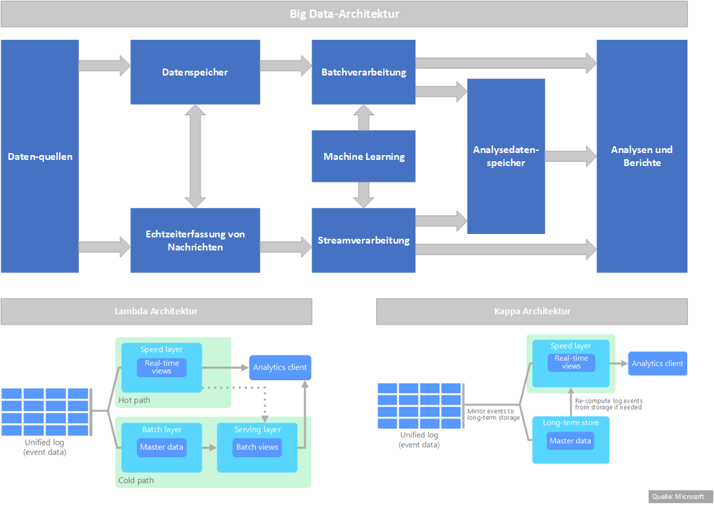

# Azure Data Platform

__Azure Services erhalten regelmäßig Akutalisierungen durch neue Funktionalitäten, daher ist diese Dokumentation nicht vollständig und sondern eher ein Einstieg.__

[[_TOC_]]

## Ansprechpartner
Bei Fragen und Anmerkungen kommt gerne auf uns zu.
* [Jonas König](mailto:jonas.koenig@bertelsmann.de)
* [Maurice Müller](mailto:maurice.mueller@bertelsmann.de)
* [Sebastian Lesen](mailto:sebastian.lesen@bertelsmann.de)
* [Sven Guttmann](mailto:sven.guttmann@bertelsmann.de)

## Einleitung

Auf diesen Seiten wird ein Entwurfsmuster für Big Data-Architekturen in der Cloud und insbesondere in Azure aufgezeigt.

Das Szenario kann nicht vollumfänglich alle Anforderungen abbilden. Vielmehr soll es ein Einstieg in die Möglichkeiten der Big Data-Architektur geben. Gleichzeitig wollen wir einiges an Skripten für den automatisierten Aufbau einer solchen Plattform bereitstellen und auch schon einmal die monatlichen Kosten überschlagen.

In den konkreten Projekten wird man auf Kundenanforderungen analysieren, die geeigneten Azure Services auswählen und eine entsprechende Architektur aufbauen.

> Beim Aufbau der Resourcen sollte darauf geachtet werden, dass das sofern möglich in einer Azure Region geschieht. Andernfalls werden bei der Verarbeitung Daten zwischen den Regionen hin- und herkopiert, was auf der einen Seite Auswirkungen auf die Performance und zum anderen auf die Consumption haben kann, da hierfür zusätzliche Kosten anfallen. Insofern sollte vor dem Aufbau der Resource geprüft werden, ob alle in der jeweiligen Region verfügbar sind.

> Bei den hier aufgeführten Kosten sind tagesaktuell und nur Indikationen. Es empfiehlt sich, die Kosten für das jeweilige Setup zu berechnen und nach dem Aufbau der Services ein monatliches Review durchzuführen. Hier gehts zum [Azure Preis Kalkulator](https://azure.microsoft.com/de-de/pricing/calculator/).

## Big Data-Architektur

Big Data-Architektur nach [Microsoft](https://docs.microsoft.com/de-de/azure/architecture/data-guide/big-data/)

## Azure Services
Nachfolgend eine Liste von Services, mit denen sich eine Azure Data Platform aufbauen lässt.

* __Datenquellen__: Dort wo alles beginnt. Datenquellen können sich sowohl in lokalen Rechenzentren als auch in der Cloud befinden. Dabei kann es sich um strukturierte, semi-strukturierte oder unstrukturierte Daten handeln.
* __Datenspeicher:__ Meistens auch bekannt unter dem Begriff Data Lake.
  * [Azure Storage-Blobs](https://docs.microsoft.com/en-us/azure/storage/blobs/storage-blobs-introduction)
  * [Azure Data Lake Store](https://docs.microsoft.com/en-us/azure/data-lake-store)
  * [Azure SQL-Datenbank](https://docs.microsoft.com/en-us/azure/sql-database/)
  * [Azure Cosmos DB](https://docs.microsoft.com/en-us/azure/cosmos-db)
  * [HBase in HDInsight](https://hbase.apache.org/)
  * [Azure Data Explorer](https://docs.microsoft.com/en-us/azure/data-explorer/)
  * [Azure Monitor](https://docs.microsoft.com/de-de/azure/azure-monitor/overview)
    * [Application Insights](https://docs.microsoft.com/de-de/azure/azure-monitor/app/app-insights-overview)
    * [Log Analytics](https://docs.microsoft.com/de-de/azure/azure-monitor/logs/log-query-overview)
* __Batchverarbeitung:__ Der Klassiker bei der Datenverarbeitung. In der Regel langlaufenden Prozesse zur Erfassung, Verarbeitung und Laden von Daten.
  * [Azure Synapse Analytics](https://docs.microsoft.com/en-us/azure/synapse-analytics/overview-what-is)
    * [Data Flows](https://docs.microsoft.com/en-us/azure/synapse-analytics/concepts-data-flow-overview)
    * [SQL Skripte](https://docs.microsoft.com/en-us/azure/synapse-analytics/sql/author-sql-script)
    * [Synapse Notebooks](https://docs.microsoft.com/en-us/azure/synapse-analytics/spark/apache-spark-development-using-notebooks)
  * [Azure Data Factory](https://docs.microsoft.com/en-us/azure/data-factory/)
    * [Data Flows](https://docs.microsoft.com/en-us/azure/data-factory/concepts-data-flow-overview)
  * [HDInsight](https://docs.microsoft.com/de-de/azure/hdinsight/)
    * [Spark](https://docs.microsoft.com/en-us/azure/hdinsight/spark/apache-spark-overview)
    * [Hive](https://docs.microsoft.com/en-us/azure/hdinsight/hadoop/hdinsight-use-hive)
    * [Hive LLAP](https://docs.microsoft.com/en-us/azure/hdinsight/interactive-query/apache-interactive-query-get-started)
    * [MapReduce](https://docs.microsoft.com/en-us/azure/hdinsight/hadoop/hdinsight-use-mapreduce)
  * [Azure Data Bricks](https://docs.microsoft.com/en-us/azure/azure-databricks/)
  * [SSIS](https://docs.microsoft.com/en-us/azure/data-factory/how-to-invoke-ssis-package-ssis-activity?tabs=data-factory)
  * [SQL Stored Procedures](https://docs.microsoft.com/en-us/sql/relational-databases/stored-procedures/stored-procedures-database-engine)
* __Echtzeiterfassung von Nachrichten:__ Bietet die Möglichkeit Datenströme in Echtzeit entgegenzunehmen.
  * [Azure Event Hubs](https://docs.microsoft.com/en-us/azure/event-hubs/)
  * [Azure IoT Hub](https://docs.microsoft.com/en-us/azure/iot-hub/)
  * [Kafka in HDInsight](https://docs.microsoft.com/en-us/azure/hdinsight/kafka/apache-kafka-get-started)
* __Streamverarbeitung:__ Transformation der in Echzeit entgegengenommen Daten.
  * [Azure Stream Analytics](https://docs.microsoft.com/de-de/azure/stream-analytics/stream-analytics-introduction)
  * [Apache Storm](https://docs.microsoft.com/en-us/azure/hdinsight/storm/apache-storm-overview)
  * [Apache Spark Streaming](https://docs.microsoft.com/en-us/azure/hdinsight/spark/apache-spark-streaming-overview)
  * [Azure Databricks Streaming](https://docs.microsoft.com/en-us/azure/databricks/spark/latest/structured-streaming/)
* __Analysedatenspeicher:__ Stellen die Daten für die Analyse bereit.
  * [Azure Synapse Analytics](https://docs.microsoft.com/en-us/azure/synapse-analytics/overview-what-is)
    * [Dedizierter SQL Pool](https://docs.microsoft.com/en-us/azure/synapse-analytics/sql-data-warehouse/sql-data-warehouse-overview-what-is)
  * [Azure Synapse Spark-Pools](https://docs.microsoft.com/en-us/azure/synapse-analytics/spark/apache-spark-overview)
  * [Azure Databricks](https://docs.microsoft.com/en-us/azure/databricks/scenarios/what-is-azure-databricks)
  * [Azure Data Explorer](https://docs.microsoft.com/en-us/azure/data-explorer/)
  * [Azure SQL-Datenbank](https://docs.microsoft.com/en-us/azure/sql-database/)
  * [SQL Server auf einer Azure-VM](https://docs.microsoft.com/en-us/sql/sql-server/sql-server-technical-documentation)
  * [HBase/Phoenix in HDInsight](https://docs.microsoft.com/en-us/azure/hdinsight/hbase/apache-hbase-overview)
  * [Hive LLAP in HDInsight](https://docs.microsoft.com/en-us/azure/hdinsight/interactive-query/apache-interactive-query-get-started)
  * [Azure Analysis Services](https://docs.microsoft.com/en-us/azure/analysis-services/analysis-services-overview)
  * [Azure Cosmos DB](https://docs.microsoft.com/en-us/azure/cosmos-db/introduction)
* __Analysen und Berichte:__ Ermöglicht die Einsicht in die Daten um daraus entsprechende Mehrwerte zu generieren.
  * [Power BI](https://docs.microsoft.com/en-us/power-bi/)
  * [Jupyter-Notebooks](https://jupyter.readthedocs.io/en/latest/index.html)
  * [Zeppelin-Notebooks](https://zeppelin.apache.org/)
  * [Microsoft Azure Notebooks](https://notebooks.azure.com/)
* __Orchestrierung:__ Automatisierung von sich wiederholenden Verarbeitungsprozessen.
  * [Azure Data Factory](https://docs.microsoft.com/en-us/azure/data-factory/) und [Azure Synapse Analytics](https://docs.microsoft.com/en-us/azure/synapse-analytics/overview-what-is)
    * [Pipelines und Aktivitäten](https://docs.microsoft.com/en-us/azure/data-factory/concepts-pipelines-activities)
  * [Oozie in HDInsight](https://docs.microsoft.com/en-us/azure/hdinsight/hdinsight-use-oozie-linux-mac)
  * [SQL Server Integration Services (SSIS)](https://docs.microsoft.com/en-us/sql/integration-services/sql-server-integration-services)

## Umsetzung
* Erarbeiten einer (minimale) Governance
* Definition und Kalkulation der Azure Services
* Bereitstellung der Subscription
* Definition des Budgets in der Subscription
* Erstellen von Security Groups und Zuweisung der Rollen
  * Anfrage zum Erstellen der Security Group im Bertelsmann Tenant an die 8000.
* Automatisierter Aufbau der Azure Services

## Resourcen
* [Azure Preis Kalkulator](https://azure.microsoft.com/de-de/pricing/calculator/)
* [Azure CLI](https://docs.microsoft.com/de-de/cli/azure/install-azure-cli)
* [Microsoft Azure PowerShell Cmdlets](https://www.powershellgallery.com/packages/Az/)
* [Terraform by HashiCorp](https://www.terraform.io/)
* [Infrastructure As Code (IaC)](https://confluence.arvato-systems.de/confluence/pages/viewpage.action?pageId=141139963)
* [Visio Stencils von David Summers](https://github.com/David-Summers/Azure-Design)
* [Visio Stencils von Sandro Pereira](https://github.com/sandroasp/Microsoft-Integration-and-Azure-Stencils-Pack-for-Visio)

---
&#129045; [Inhaltsverzeichnis](00_Inhaltsverzeichnis.md) &ensp;|&ensp; [Data Governance by Microsoft](02_Data_Governance_by_Microsoft.md) &#129046;