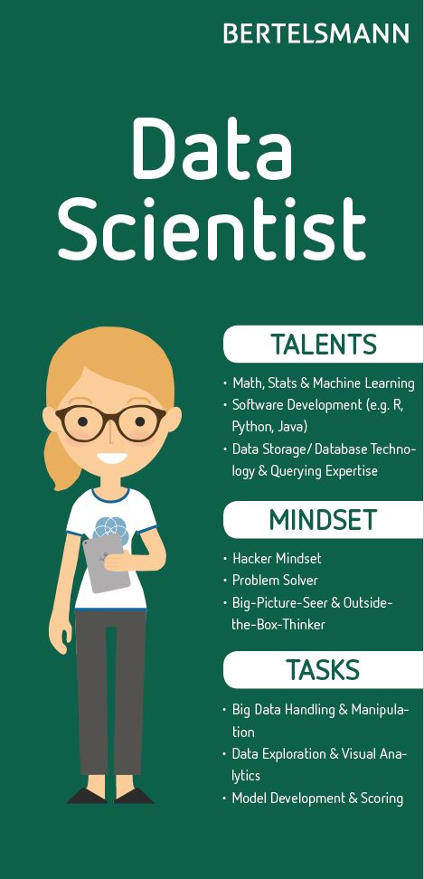

# Data Platform Rollen

[[_TOC_]]

Vollständige Liste der [Integrierten Azure-Rollen](https://docs.microsoft.com/en-us/azure/role-based-access-control/built-in-roles) und [Synapse RBAC-Rollen](https://docs.microsoft.com/en-us/azure/synapse-analytics/security/synapse-workspace-synapse-rbac-roles)

Im Bertelsmann Tenant werden die Security Groups über die 8000 erstellt. Bitte eine entsprechende E-Mail mit dem Gruppennamen (Data Platform Roles) und den initialen Mitgliedern an die Kollegen schicken.

Erster Entwurf für die Gruppen und Rollen, basierend auf Informationen vom Bertelsmann Advanced Analytics Day.

Poster wurden von [André Schöpp](mailto:andre.schoepp@bertelsmann.de) und [Carsten Mönning](mailto:carsten.moenning@bertelsmann.de) entworfen/bereitgestellt.

## Business Analyst

### Talents

* Profound Business Know-how
* Business Intelligence Tools (e.g. Tableau, Power BI)
* Business Process Expert

### Mindset

* Business Aficionado
* Ideas Provider
* Opportunity Recognizer

### Tasks

* Storytelling
* Self Service User
* Business Process Optimization

### Azure Built-in Roles

* Not relevant

### Poster

## Business Partner

### Talents

* Specialist of Branch
* Natural Born Communicator
* Presentation Skills

### Mindset

* Leader Attitude
* Business-Value-Oriented
* Bound and Determined

### Tasks

* Project & Change Management
* Information Design
* Decision Making

### Azure Built-in Roles

* Not relevant

### Poster

## Data Analyst

### Talents

* Understanding for Data Warehouse
* Extraction Transformation and Load (ETL)
* Skilled in Database Systems

### Mindset

* Data Aficionado
* Investigative Nature
* Accurate in Every Detail

### Tasks

* Data Modeling
* Data Analysis
* Standardization

### Azure Built-in Roles

* Reader
* Key Vault Reader
* Log Analytics Reader
* Storage Blob Data Reader
* Storage File Data SMB Share Reader
* Storage Queue Data Reader
* Storage Table Data Reader
* Synapse Artifact Publisher
* Synapse Artifact User

### Poster

## Data & Platform Engineer

### Talents

* Advanced Software Development / Engineering Skills (e.g. Scala, Java, Python)
* Data Modeling & ETL
* DevOps & Continous Devlivery / Integration

### Mindset

* Administrative Responsiblity
* Agile Data Cruncher
* All-Purpose Handyman

### Tasks

* Data Integration
* Data Quality Improvement
* Data Transformation

### Azure Built-in Roles

* Apache Spark Administrator
* Contributor
* Data Factory Contributor
* Key Vault Administrator
* Log Analytics Contributor
* SQL DB Contributor
* SQL Server Contributor
* Storage Account Contributor
* Storage Blob Data Contributor
* Storage File Data SMB Share Contributor
* Storage Queue Data Contributor
* Storage Table Data Contributor
* Synapse Administrator
* Synpase Contributor
* Synapse SQL Administrator

### Poster

## Data Scientist

* Math, Stats & Machine Learning
* Software Development (e.g. R, Python, Java)
* Data Storage / Database Technology & Quering Expertise

### Talents

* Hacker Mindset
* Problem Solver
* Big-Picture-Seer &amp; Outside-the Box-Thinker

### Mindset

* Big Data Handling &amp; Manipulation
* Data Exploration &amp; Visual Analytics
* Model Development &amp; Scoring

### Tasks

* Big Data Handling & Manipulation
* Data Exploration & Visual Analytics
* Model Development & Scoring

### Azure Built-in Roles

* Reader
* Key Vault Reader
* Log Analytics Reader
* Storage Blob Data Reader
* Storage File Data SMB Share Reader
* Storage Queue Data Reader
* Storage Table Data Reader
* Synapse Artifact Publisher
* Synapse Artifact User

### Poster

## Data Steward

### Talents

* Profound Domain Know-how
* Quality Gate for Master, Meta or Transactional Data
* Data Warehousing, ERP, CRM

### Mindset

* Allrounder
* Versatile Generalist
* Ownership Mentality

### Tasks

* Data Owner
* Data Governance
* Master of Data

### Azure Built-in Roles

* Reader
* Data Factory Contributor
* Key Vault Certificates Officer
* Key Vault Crypto Officer
* Key Vault Secrets Officer
* Log Analytics Reader
* Storage Blob Data Owner
* Synapse Artifact Publisher
* Synapse Artifact User

### Poster

## Weitere Azure Active Directory User

Zusätzlich sollten noch folgende Azure Active Directory User angelegt werden.

### SQL Azure Active Directory Administrator

Berechtigung weiterer Azure Active Directory User und Managed Identities im SQL Server</td>

### SQL Azure Active Directory Synapse Workspace Administrator

Berechtigung weiterer Azure Active Directory User und Managed Identities im dedizierten SQL Pool.</td>

### Synapse Workspace Azure Active Directory Administrator

Adminstration des Azure Synapse Workspace.

---
&#129044; [Azure Data Platform](01_Azure_Data_Platform.md) &ensp;|&ensp; &#129045; [Inhaltsverzeichnis](00_Inhaltsverzeichnis.md) &ensp;|&ensp; [Azure Data Platform Architektur](04_Azure_Data_Platform_Architektur.md) &#129046;
