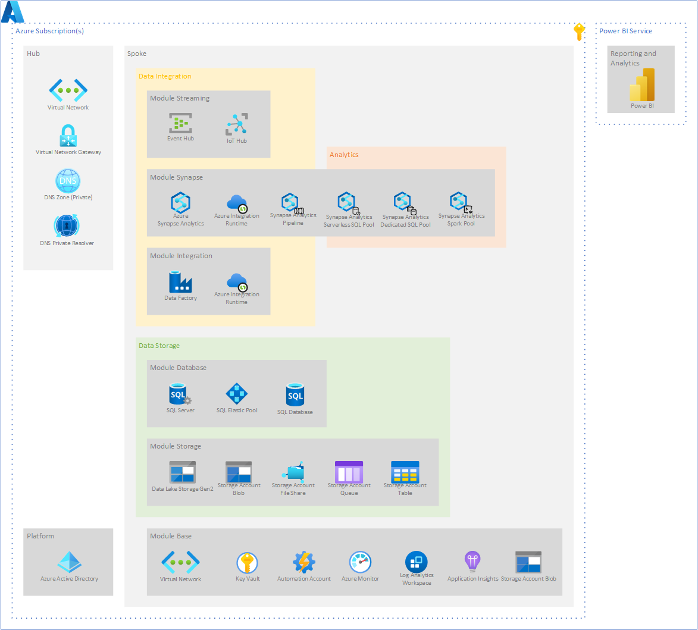
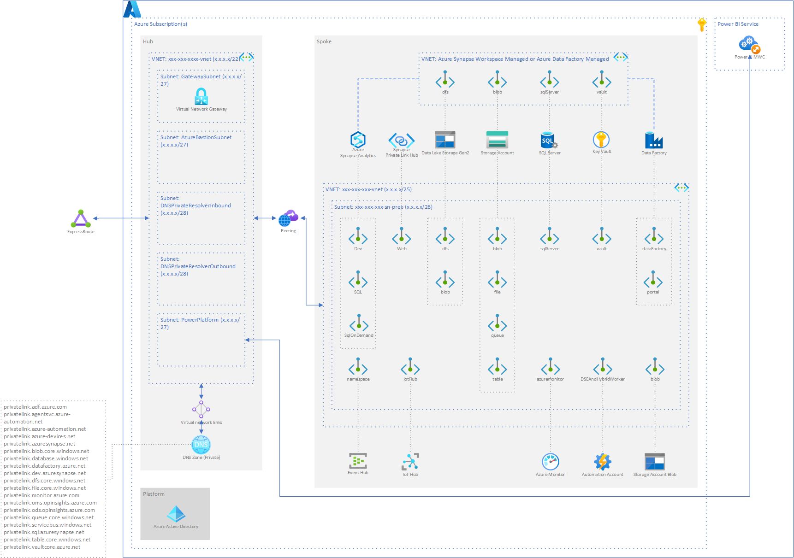

# Azure Data Platform Architektur

[[_TOC_]]

## Azure Services

## Integration und Berechtigungen

___TBD___

## Netzwerk

## Resourcen
[Azure Analytics End to End with Azure Synapse - Deployment Accelerator](https://github.com/fabragaMS/azure-synapse-analytics-end2end)

---
&#129044; [Data Platform Rollen](03_Data_Platform_Rollen.md) &ensp;|&ensp; &#129045; [Inhaltsverzeichnis](00_Inhaltsverzeichnis.md) &ensp;|&ensp; [Terraform Hub](05_Terraform_Hub.md) &#129046;
